# Pop Party!

Link to the deployed app: https://pop-party.herokuapp.com/
Link to github repo: https://github.com/MartinVald2170/marketplace_assignment

 #### Purpose  
Currently Pop Party is a 2 way Funko Pop marketplace for users to buy and sell pops and be able to message users about listings they have.
In the future I want it to be built into a Social Hub for pop collectors to view their collection, show off their collection, purchase, trade, sell and view news regarding new releases or conventions around them so they can go get a Pop signed by an actor, famous figure or voice actor. 

#### Functionality / features  
- User Login and Sign Up - Users can sign up with their email and create a password to login with before they are able to use features within the app 
- Listings - Logged in users can create listings to sell their Funko Pop. Users can see all listings available in one page, they can also edit and delete their own listings from that page

- Messaging - Users can message users for more information on the Pop and reply to messages about their listings

#### Sitemap  
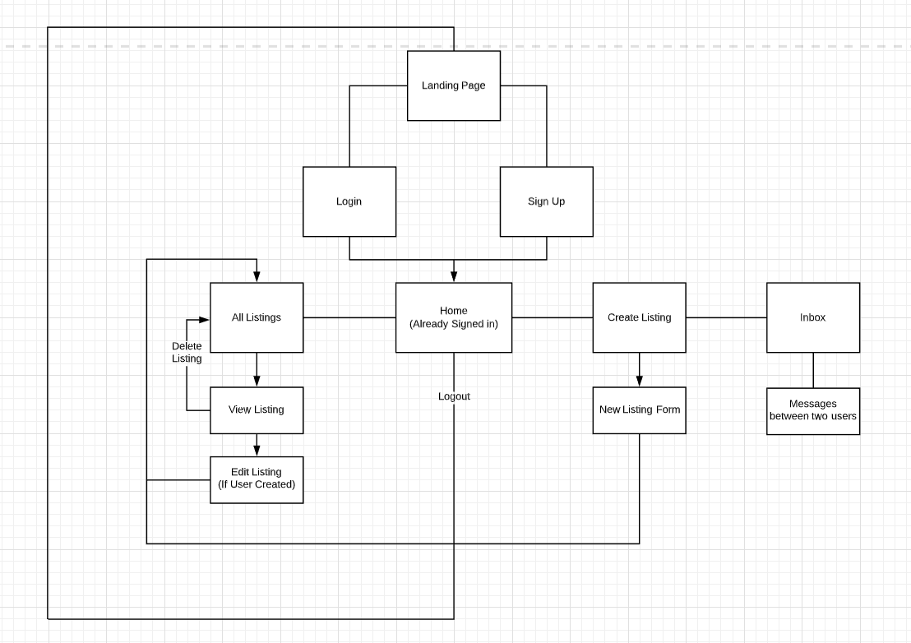

#### Screenshots of the website   
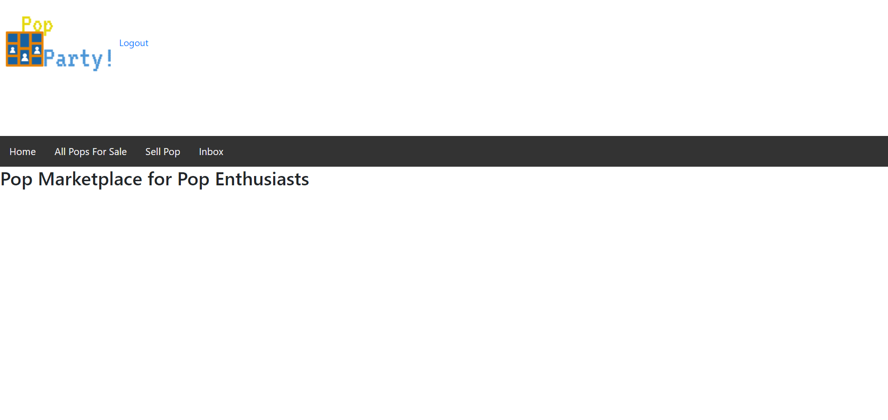
Landing Page

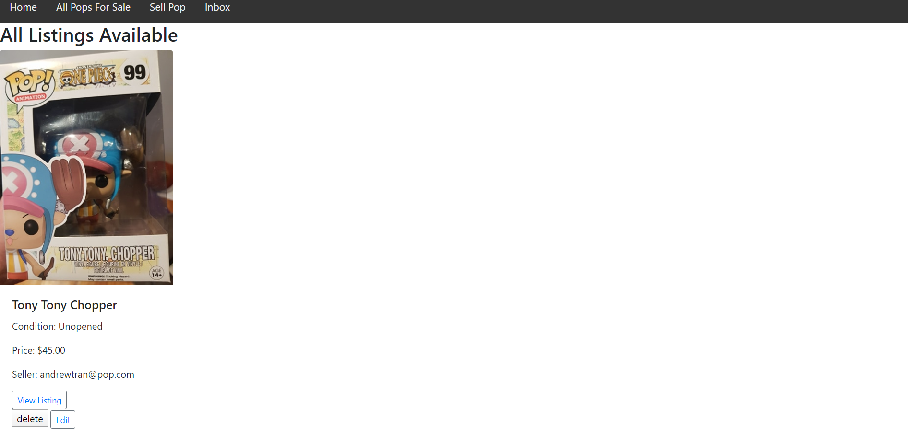
All Listings

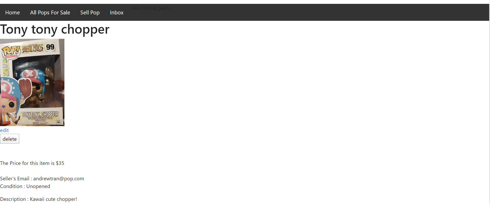
A Listing

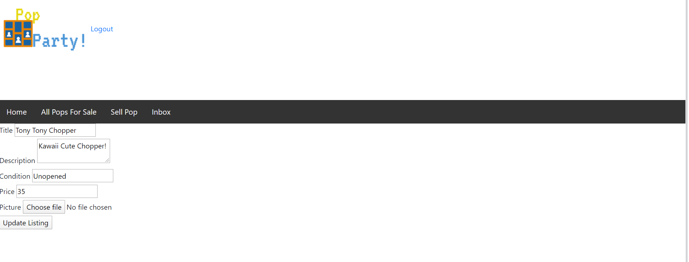
Create/Edit

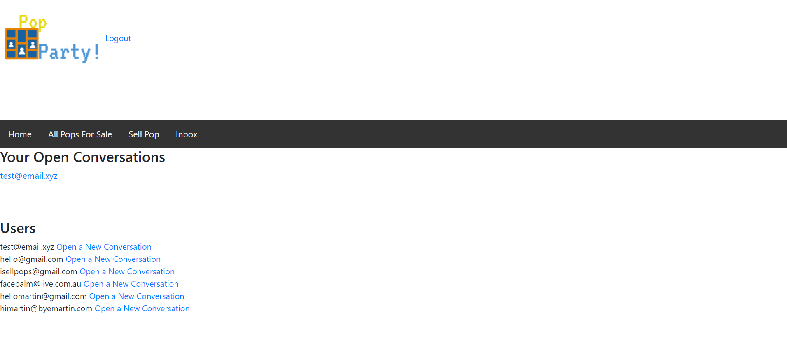
Inbox

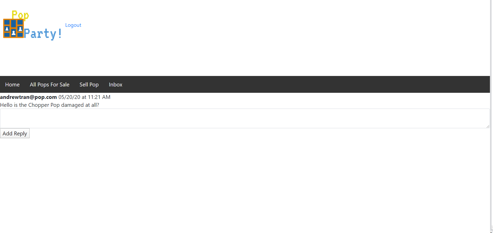
Messages

#### Target audience 
Casual and Hardcore Pop Collectors from around the world

#### Tech stack 
- Frond end - HTML5, CSS3, SCSS, ,Embedded Ruby, Bootstrap 4 
- Back End - rails 6.0.3, ruby 2.5.8
- Database - Postgresql, D-Beaver
- Deployment - Heroku 
- Utilities - Devise, AWS S3
- DevOps - Git, Hithub, VS code, Bundler, Balsamiq, Lucidchart
## 1. Explain the different high-level components (abstractions) in your App.

Pop Party! is a 2 sided-marketplace web app built with Ruby on Rails framework with Bootstrap 4 and Postgresql as the database. The MVC architecture is implemented with RoR (model,view,controller). The views contain Ruby and HTML in an .erb file, the models hold the methods used to process the data and the controller uses logic to link the two together. 

Devise is the Ruby Gem implemented to be able to check whether a user needs to sign up or can login if they have visted before. Within the Ruby code it allows us to check if a user is logged in before using features on their own listings and inbox such as messaging, editing and deleting.  
Users can create a new listing after logging in and have an option to upload an image in png,jpeg or jpg. 

Users are able to enter their inbox to check on currently opened conversations and users who are able to be messaged as their emails being used as a username. This allows the user to ask and asnwer any questions about a listing.
## 2. List and describe any 3rd party services.
### Devise :  
Devise is a ruby gem which allows flexible authentication to be established within your app. It does all the heavy work behind the scenes to streamline security and all the work that comes with creating functions for users to login and create a profile which maintains database integrity. Devise also allows the helper method

        before_action : authenticate_user!

which can be added to views and controllers to set it up with user authentication.   
### Amazon S3:   
Gem and webservice which allows image upload and cloud-based storage for use within my rails application.  

### Bootstrap:  
Bootstrap is a CSS/HTML framework to streamline styling and formatting for your webpages 

## 3.1. Identify the problem you’re trying to solve by building this particular marketplace App?
 
Funko pop collecting is a larger community than people realise, take a look at any collectors store. There are walls full of Funko Pops but there is nowhere to call home and have a community. There are selling sites, information sites and forums but there is no fan/collector hub for them made by someone in the community. 

## 3.2 Why is the problem identified a problem that needs solving?  
A one stop place to buy,see news, communicate with other enthusiastic seller/buyers or even just showing off your collection and prized possessions is something that needs to be done. The main factor is being able to shop and sell and even trade with others. The community includes so many fanbases so there can be even a social side of the site and create connections that could last a lifetime.  

## 4. Describe your project’s models in terms of the relationships (active record associations) they have with each other. 
A user has_many listings, a listing belongs_to a user 
A user has_many messages, a message belongs_to a user  
A user has_many conversations, a conversation belongs_to a sender  
A listing has_one_attached picture, a picture belongs_to a listing  
A user has_many conversations, a conversation belongs_to a recipient  
A listing belongs_to a user, a user has_many listings  
A listing has_many favourite listings, a favourite listing belongs_to a listing   
A listing has_many favourited by through favourite listings 
A conversation has_many messages, a message belongs_to a conversation
  

    class Conversation < ActiveRecord::Base
    belongs_to :sender, :foreign_key => :sender_id, class_name: "User"
    belongs_to :recipient, :foreign_key => :recipient_id, class_name: "User"
    has_many :messages, dependent: :destroy
    validates_uniqueness_of :sender_id, :scope => :recipient_id
    scope :between, -> (sender_id,recipient_id) do
    where("(conversations.sender_id = ? AND conversations.recipient_id =? ) OR (conversations.sender_id = ? AND conversations.recipient_id =?)", sender_id,recipient_id, recipient_id, sender_id)
    end
    end 
    
    class Listing < ApplicationRecord
    belongs_to :user
    validates :title, :description, :condition, :price, presence: true
    has_one_attached :picture 
    end 

    class Message < ActiveRecord::Base
    belongs_to :conversation
    belongs_to :user
    validates_presence_of :body, :conversation_id, :user_id
    def message_time
     created_at.strftime("%m/%d/%y at %l:%M %p")
    end
    end 

    class User < ApplicationRecord
    #Include default devise modules. Others available are:
    #:confirmable, :lockable, :timeoutable, :trackable and :omniauthable
    devise :database_authenticatable, :registerable,
         :recoverable, :rememberable, :validatable
    has_many :listings, dependent: :destroy
        
    end

   
## 5. Discuss the database relations to be implemented.
Foreign keys are used to connect one relation to another that belong with each other within the database  

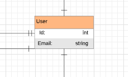

USER : The user table has many relations connected to it within the database. The id key in the user table is used within related tables as user_id with the use of references.  

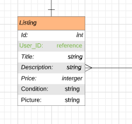   
LISTING: A listing belongs to a user, the listing table is one of the relations for the user table therefore a foreign key of user_id is used within the Listings table to connect them  

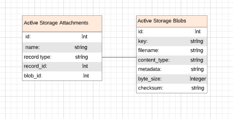  

ACTIVE RECORD:  The active storage blob table relate to image uploads within the app and are polymorphic. A listing can have an image and no other tables connect to the active record table however within the models a has_one image is defined.

The active storage attachments table contains data on the record types within the app database , the foreign key present for record id, depends on the record type. The blobs table is related to the attatchment table through the foreign key of blob_id

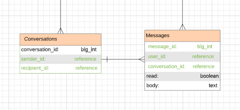  

CONVERSATIONS AND MESSAGES: Conversations belong to two users within the database. This is tracked with a sender_id and a recipient_id but only one conversation_id can be used within a conversation between 2 people. 

The messages table contains the conversation_id which contains the recorded data for each messageand the user_id used keeps track of the users involved within the conversation and messages 

## 6. Provide your database schema design.
Each table within the database contains a created_at: datetime and updated_at: datetime attribute  

    Users: 
    email: string
    password: string
    reset_password_token: string

    Listings: 
    user_id: references
    title: string
    description: text
    condition: string
    price: integer
    picture: 

    Messages: 
    body: string
    conversation_id: references
    user_id: references
    read: boolean true:false 

    Conversations: 
    sender_id: reference 
    recipient_id: references 

    Active Storage Attatchments: 
    name: string
    record_type: string
    record_id: references
    blob_id: references

    Active Storage Blob:
    key: string
    filename: string
    content_type: string
    byte_size: big integer
    metadata: text
    checksum: string

## 7. Provide User stories for your App.
## User stories
Everyone can buy and sell as a user but must be logged in and have signed up 
### User management:
- As a user I want to be able to sign up to create a profile to start  selling and buying 
- As a user I want to login with an email and password 
      - As a user I want to be able to logout with one click

### Listings:
- As a user I want to navigate to all the listings on the site easily
- As a user I want to create a listing to sell a pop 
- As a user I want to edit my listings to correct any mistakes I have made or need to change anything 
- As a user I want to delete my listings when they have been sold or are not for sale anymore 
- As a user I want to be the only one who can edit and delete my listings 
- As a user I want to be able to message and receive messages about a listing 
### Authentication & Authorisation:
- As a user I would like to be able to not worry about other users being able to get into my account
- As a user I do not want others to access my inbox
- As a user I want to have my password safe 

## 8. Provide Wireframes for your App.
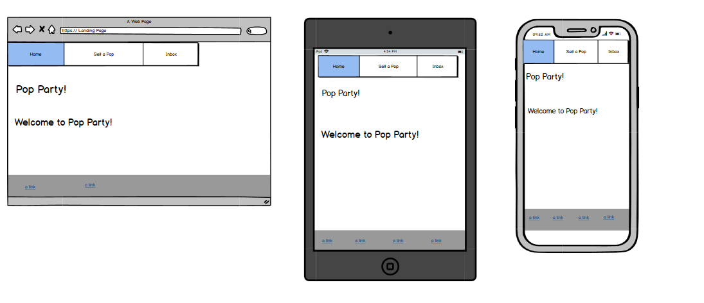 
Landing Page 

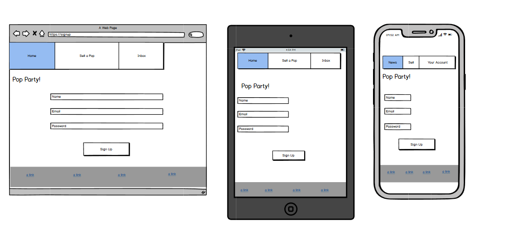 
Sign Up 

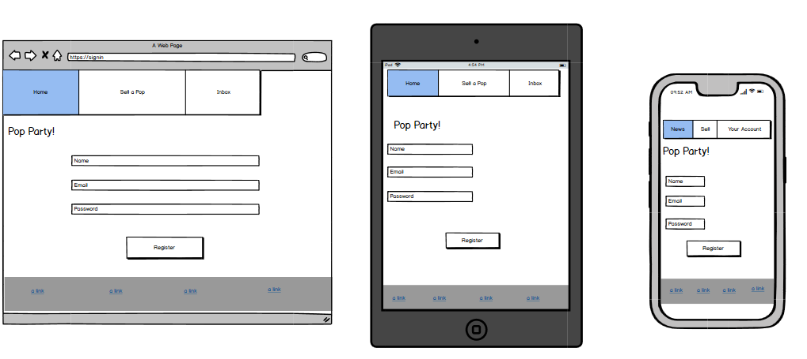 
Sign In  

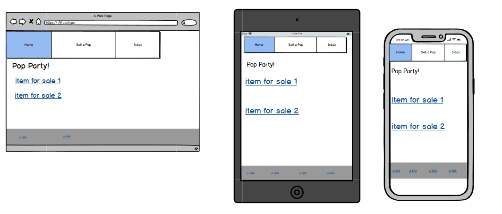  
All Listings

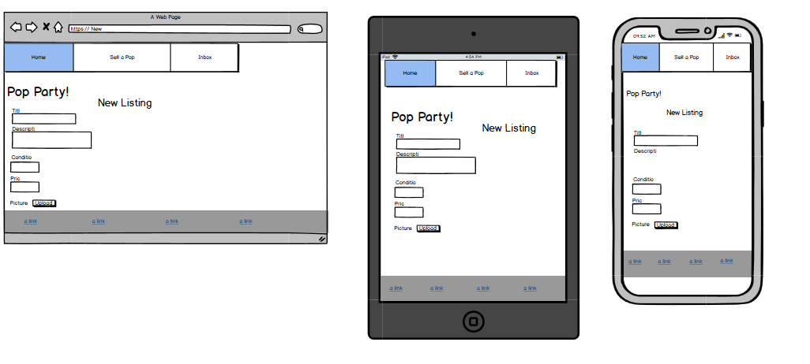  
New Listing

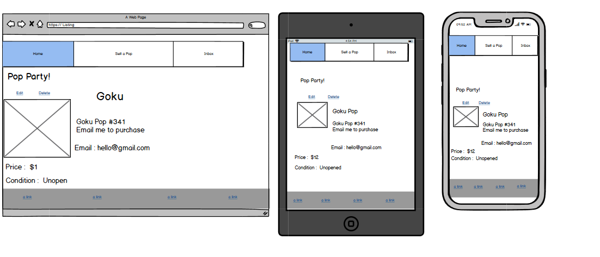  
Show Listing

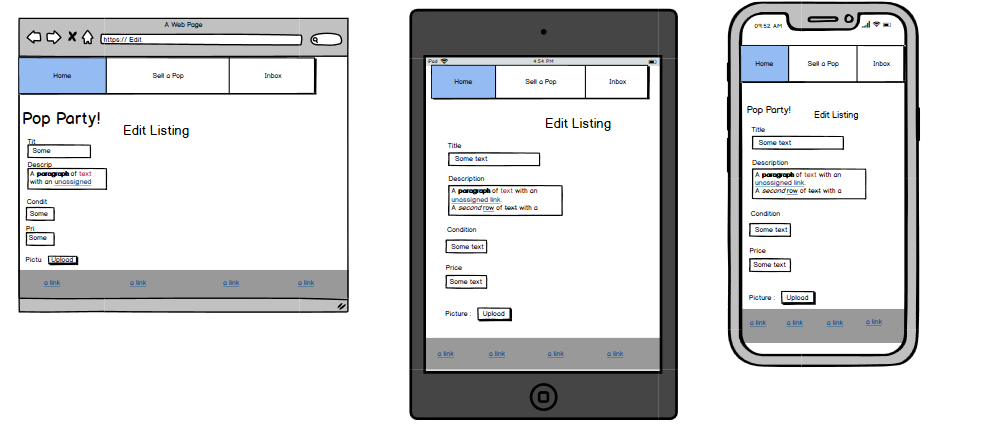  
Edit Listing

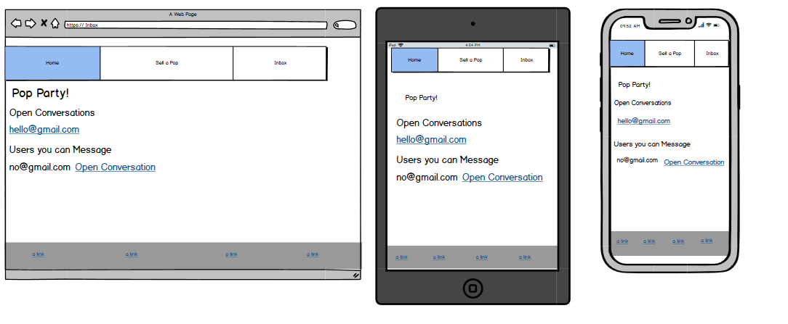 
Inbox
## 9. Describe the way tasks are planned and tracked in your project.

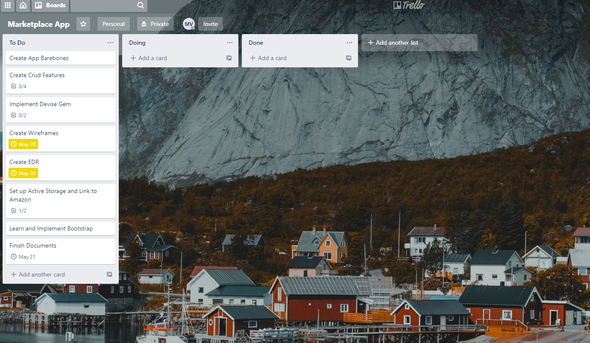
Trello Stage 1

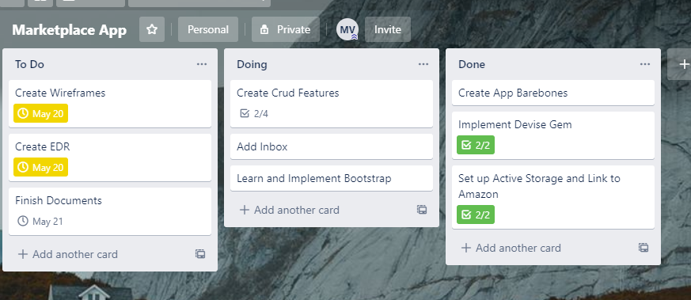
Trello Stage 2

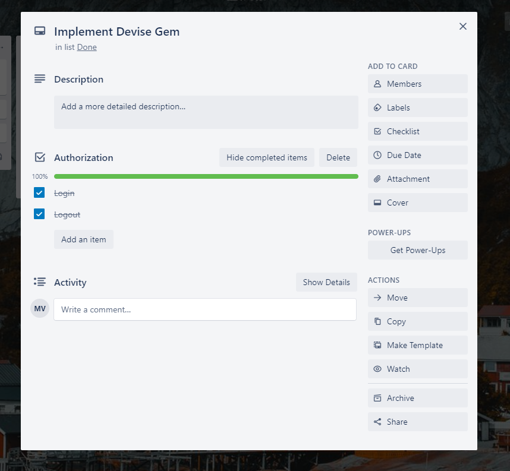
Devise Checklist

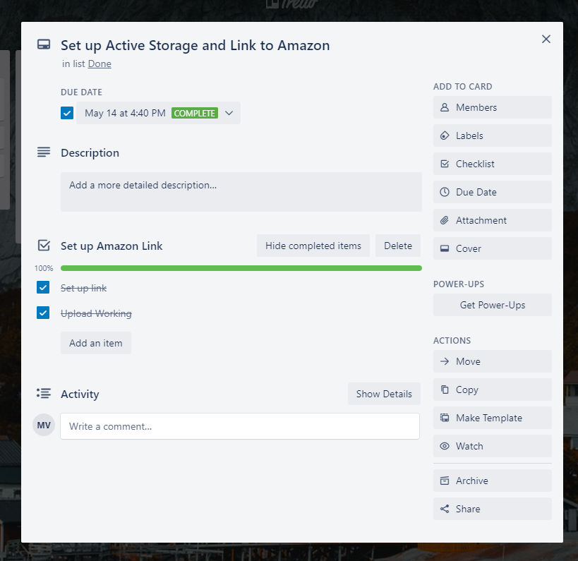
S3 Checklist

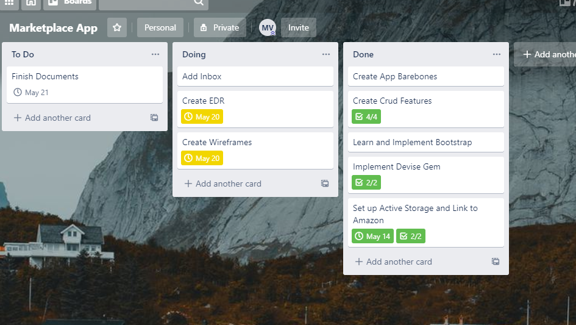
Trello Stage 3

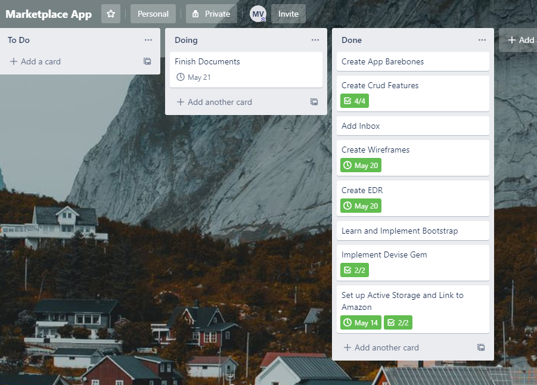
Trello Stage 4

I managed this project using Trello and incooperating agile methodology adapting after creating the intital CRUD features, user authentication using Devise and image uploads using s3 Amazon services and Ruby Gem. I made sure to fully utulise the checklist and due date features within trello to help keep track and to have a positive visual when I get things done 

Styling was the least important feature within this project since that can be implimented later in the project to keep the app features easy to identify. 

## 10. ERD provided represents a normalised database model.
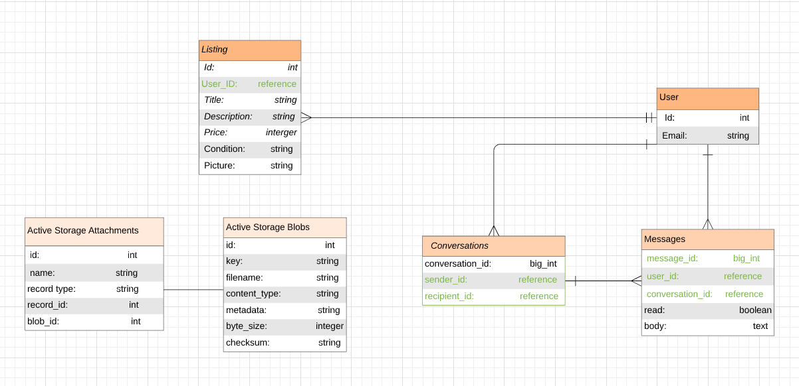
Full ERD 
